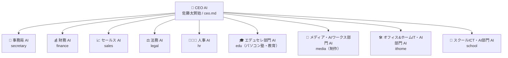
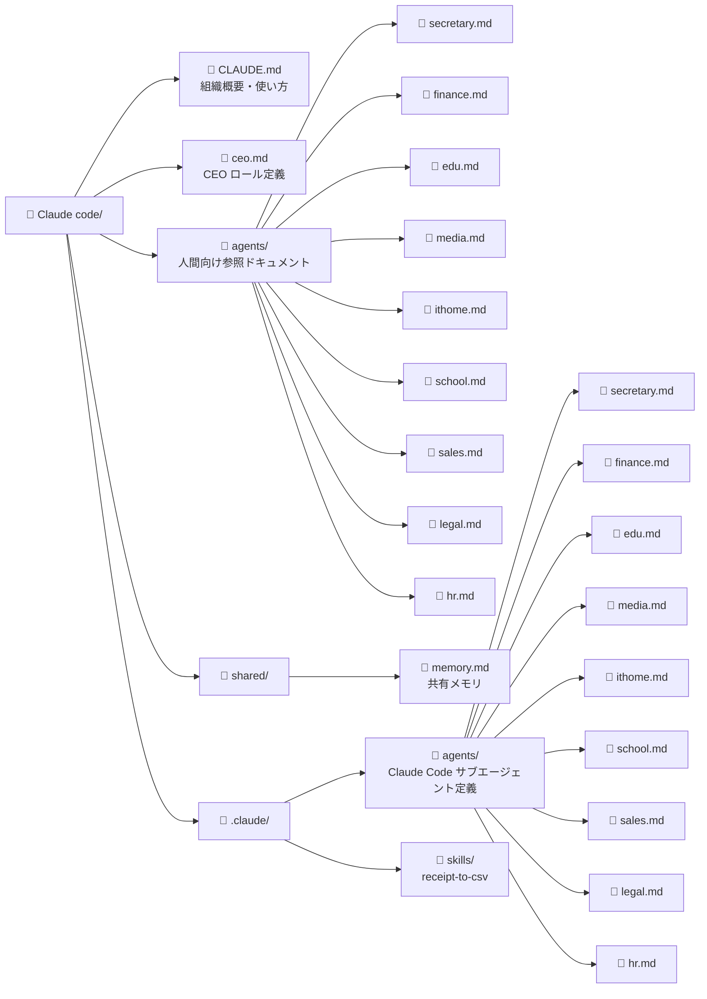
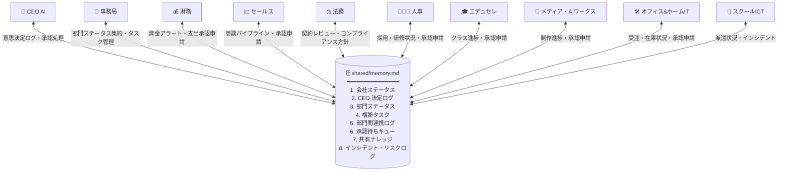
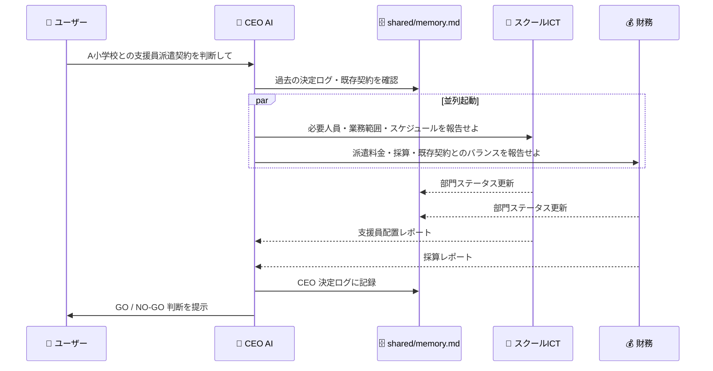
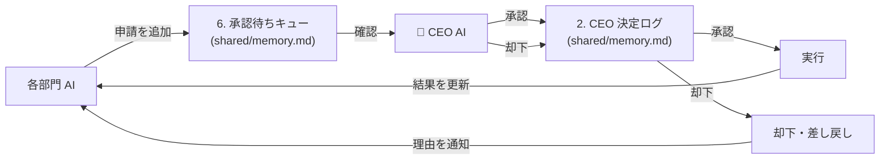

# パコラボ株式会社 — 構造図

## 1. 組織階層

```mermaid
graph TD
    CEO["🏢 CEO AI<br/>佐藤太賀始 / ceo.md"]

    SEC["📅 事務局 AI<br/>secretary"]
    FIN["💰 財務 AI<br/>finance"]
    SAL["📈 セールス AI<br/>sales"]
    LEG["⚖️ 法務 AI<br/>legal"]
    HR["🧑‍🤝‍🧑 人事 AI<br/>hr"]
    EDU["🎓 エデュセレ部門 AI<br/>edu（パソコン塾・教育）"]
    MED["🎨 メディア・AIワークス部門 AI<br/>media（制作）"]
    ITH["🛠️ オフィス&ホームIT・AI部門 AI<br/>ithome"]
    SCH["🏫 スクールICT・AI部門 AI<br/>school"]

    CEO --> SEC
    CEO --> FIN
    CEO --> SAL
    CEO --> LEG
    CEO --> HR
    CEO --> EDU
    CEO --> MED
    CEO --> ITH
    CEO --> SCH
```

---

## 2. ファイル構造

```mermaid
graph LR
    ROOT["📁 Claude code/"]

    ROOT --> CLAUDE["📄 CLAUDE.md<br/>組織概要・使い方"]
    ROOT --> CEO_F["📄 ceo.md<br/>CEO ロール定義"]
    ROOT --> AGENTS_D["📁 agents/<br/>人間向け参照ドキュメント"]
    ROOT --> SHARED["📁 shared/"]
    ROOT --> DOTCLAUDE["📁 .claude/"]

    AGENTS_D --> A1["📄 secretary.md"]
    AGENTS_D --> A2["📄 finance.md"]
    AGENTS_D --> A3["📄 edu.md"]
    AGENTS_D --> A4["📄 media.md"]
    AGENTS_D --> A5["📄 ithome.md"]
    AGENTS_D --> A6["📄 school.md"]
    AGENTS_D --> A7["📄 sales.md"]
    AGENTS_D --> A8["📄 legal.md"]
    AGENTS_D --> A9["📄 hr.md"]

    SHARED --> MEM["📄 memory.md<br/>共有メモリ"]

    DOTCLAUDE --> AGENTS_SUB["📁 agents/<br/>Claude Code サブエージェント定義"]
    DOTCLAUDE --> SKILLS["📁 skills/<br/>receipt-to-csv"]
    AGENTS_SUB --> B1["📄 secretary.md"]
    AGENTS_SUB --> B2["📄 finance.md"]
    AGENTS_SUB --> B3["📄 edu.md"]
    AGENTS_SUB --> B4["📄 media.md"]
    AGENTS_SUB --> B5["📄 ithome.md"]
    AGENTS_SUB --> B6["📄 school.md"]
    AGENTS_SUB --> B7["📄 sales.md"]
    AGENTS_SUB --> B8["📄 legal.md"]
    AGENTS_SUB --> B9["📄 hr.md"]
```

---

## 3. 情報フロー（共有メモリを中心に）

```mermaid
graph TD
    MEM[("🗄️ shared/memory.md\n━━━━━━━━━━━━━━━\n1. 会社ステータス\n2. CEO 決定ログ\n3. 部門ステータス\n4. 横断タスク\n5. 部門間連携ログ\n6. 承認待ちキュー\n7. 共有ナレッジ\n8. インシデント・リスクログ")]

    CEO["🏢 CEO AI"]
    SEC["📅 事務局"]
    FIN["💰 財務"]
    SAL["📈 セールス"]
    LEG["⚖️ 法務"]
    HR["🧑‍🤝‍🧑 人事"]
    EDU["🎓 エデュセレ"]
    MED["🎨 メディア・AIワークス"]
    ITH["🛠️ オフィス&ホームIT"]
    SCH["🏫 スクールICT"]

    CEO <-->|"意思決定ログ・承認処理"| MEM
    SEC <-->|"部門ステータス集約・タスク管理"| MEM
    FIN <-->|"資金アラート・支出承認申請"| MEM
    SAL <-->|"商談パイプライン・承認申請"| MEM
    LEG <-->|"契約レビュー・コンプライアンス方針"| MEM
    HR <-->|"採用・研修状況・承認申請"| MEM
    EDU <-->|"クラス進捗・承認申請"| MEM
    MED <-->|"制作進捗・承認申請"| MEM
    ITH <-->|"受注・在庫状況・承認申請"| MEM
    SCH <-->|"派遣状況・インシデント"| MEM
```

---

## 4. 並列オーケストレーション（例: 新しい学校との ICT 支援員派遣契約）

```mermaid
sequenceDiagram
    participant U as 👤 ユーザー
    participant C as 🏢 CEO AI
    participant M as 🗄️ shared/memory.md
    participant S as 🏫 スクールICT
    participant F as 💰 財務

    U->>C: A小学校との支援員派遣契約を判断して
    C->>M: 過去の決定ログ・既存契約を確認

    par 並列起動
        C->>S: 必要人員・業務範囲・スケジュールを報告せよ
        C->>F: 派遣料金・採算・既存契約とのバランスを報告せよ
    end

    S-->>M: 部門ステータス更新
    F-->>M: 部門ステータス更新

    S-->>C: 支援員配置レポート
    F-->>C: 採算レポート

    C->>M: CEO 決定ログに記録
    C->>U: GO / NO-GO 判断を提示
```

---

## 5. 承認フロー

```mermaid
flowchart LR
    DEPT["各部門 AI"]
    Q["6. 承認待ちキュー\n(shared/memory.md)"]
    CEO["🏢 CEO AI"]
    LOG["2. CEO 決定ログ\n(shared/memory.md)"]
    EXEC["実行"]
    REJECT["却下・差し戻し"]

    DEPT -->|"申請を追加"| Q
    Q -->|"確認"| CEO
    CEO -->|"承認"| LOG
    CEO -->|"却下"| LOG
    LOG -->|"承認"| EXEC
    LOG -->|"却下"| REJECT
    EXEC -->|"結果を更新"| DEPT
    REJECT -->|"理由を通知"| DEPT
```
